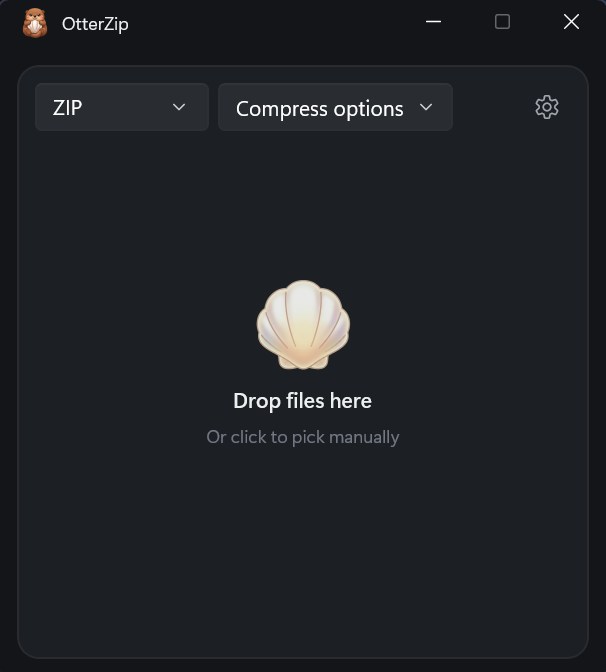
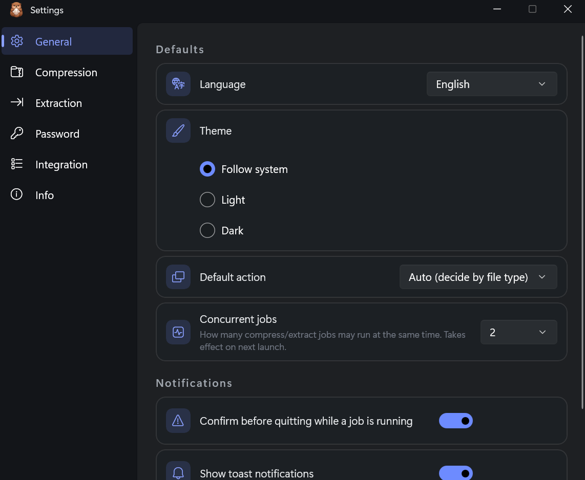

# OtterZip

**The quiet archive tool for Windows.**

Right-click to compress or extract. No ads, no accounts, no tracking.

[**Website**](https://lumibearstudio.github.io/otterzip-web/) · [**Microsoft Store**](https://apps.microsoft.com/detail/9NWQNGGSWJCL) · [**Download**](https://github.com/LumiBearStudio/OtterZip/releases/latest/download/OtterZip_x64_installer.zip)

English · [한국어](readme/README.ko.md) · [日本語](readme/README.ja.md) · [中文](readme/README.zh.md) · [Deutsch](readme/README.de.md) · [Français](readme/README.fr.md) · [Español](readme/README.es.md) · [Português](readme/README.pt.md) · [Русский](readme/README.ru.md) · [Italiano](readme/README.it.md)

 

## Zip. Done.

Right-click a file — it's zipped. Right-click an archive — it's out. You barely open the app.

## Why OtterZip

- **Right from Explorer** — compress and extract straight from the right-click menu. No window to open first.
- **One thing, done well** — no modes, no clutter, no learning curve.
- **No ads. No accounts. No tracking.** No bundles, no nagging, nothing to sign up for. Crash reports are strictly opt-in.
- **A native core, quietly fast** — the engine is written in Rust. It does the work and doesn't leave you waiting.
- **Looks like Windows, because it is** — built with C# and WinUI 3. A real native interface, not a web page in a window.
- **Yours to tune** — light, dark, or follow system. Ten languages built in.

## Install

### Microsoft Store — recommended

One-click install, and updates arrive automatically.

[Get it from the Microsoft Store](https://apps.microsoft.com/detail/9NWQNGGSWJCL)

### Direct download — free

1. Download [**OtterZip_x64_installer.zip**](https://github.com/LumiBearStudio/OtterZip/releases/latest/download/OtterZip_x64_installer.zip)
2. Extract the zip.
3. Right-click `Install.ps1` → **Run with PowerShell**, then accept the prompt.

The bundle is signed by LumiBear Studio rather than by the Store, so the first install registers our publisher certificate once — that is what the prompt is for. Step-by-step guide: [**How to install**](https://lumibearstudio.github.io/otterzip-web/install.html)

Both channels are the exact same app.

## Formats

**Create** — ZIP · 7z · TAR · TAR.GZ

**Extract** — ZIP · 7z · RAR · TAR · TAR.GZ · GZ · BZ2 · XZ · ZST · LZ4 · ISO · CAB · JAR · APK · IPA and more

AES-256 encryption and split (multi-volume) archives when you need them.

## Sensible defaults, out of the box

Theme, language, overwrite rules and more — tuned however you like, and out of the way until you need it.

## Requirements

Windows 10 (version 2004) or later · x64

## License

- `crates/**` — **MIT OR Apache-2.0** (Rust dual license)
- `app/**` — **GPL-3.0-or-later** (+ unRAR exception)

See [LICENSING.md](LICENSING.md) for details.

## Third-party notices

See [THIRD-PARTY-NOTICES.md](THIRD-PARTY-NOTICES.md). In particular **unrar** (© Alexander Roshal) is used for RAR extraction only — OtterZip never creates RAR archives.

## Privacy

No ads, no accounts, no tracking. Crash reporting is opt-in and off by default. See [PRIVACY.md](PRIVACY.md).

---

© 2026 LumiBear Studio

